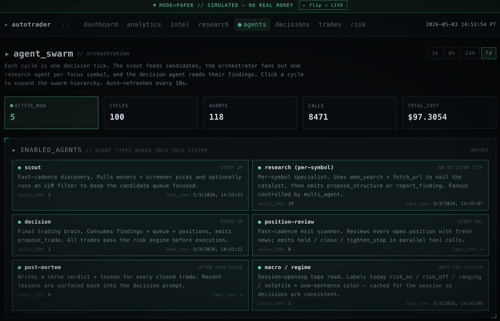
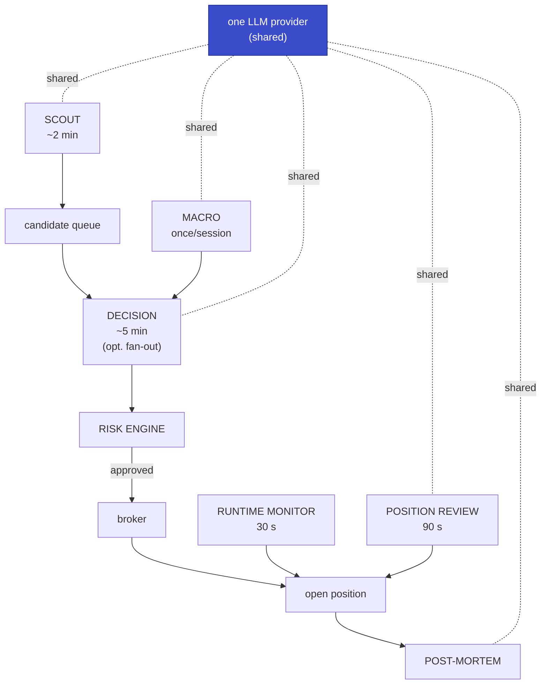

# autotrader

<p align="center">
  
</p>

**A swarm of AI agents that trades for you, around the clock, inside
risk caps you control.** Stocks, ETFs, and options through Alpaca —
prediction markets through Polymarket — every order gated by a
non-negotiable risk engine, every decision logged, every guardrail
breach halting the swarm until you unpause.

---

## What this is

**A swarm of LLM-driven agents that trades for you autonomously** — a
scout hunts candidates every two minutes, a decision agent (optionally
with per-symbol researchers fanning out in parallel) sizes and times the
entry, and a runtime monitor + position reviewer manage the trade until
exit. A post-mortem agent grades every closed trade so you can audit
whether the swarm is any good.

Every proposal runs through a non-negotiable risk engine before a broker
is ever called. Every AI decision is logged with prompt, response, and
verdict. Every guardrail breach halts trading until you unpause. Paper
mode is the default — you watch the swarm work for weeks before any real
money is at risk.

The whole thing is a FastAPI + Next.js app you run on your own machine.
No agent opens a position on its own — only the decision agent proposes,
only the risk engine approves.

**Supported markets**

- **US equities & options** (Alpaca paper or live)
- **Polymarket** prediction markets (Polygon mainnet or Amoy testnet) —
  adapter interface is in place; full loop ships after the stocks flow
  has been validated in paper for several weeks.

**Supported AI providers**

- **OpenRouter** — any hosted model behind an OpenAI-compatible API
  (Claude, GPT, Gemini, Grok, DeepSeek, Qwen hosted, …). Fast;
  per-token cost; network-dependent.
- **LM Studio** — locally-hosted OpenAI-compatible server. Free once
  the GPU is paid for; private; slower on a single GPU. Requires a
  tool-calling-capable model.

---

## Features

- **Agent swarm** — scout, macro, decision, runtime monitor, position
  reviewer, post-mortem, plus optional per-symbol researcher fan-out.
  Each one's cadence and prompt is tunable.
- **Risk engine** — budget cap, per-position cap, daily loss halt,
  drawdown halt, blacklist, stop-loss, EOD close. Editable live from
  the dashboard.
- **Intel feed** — watchlist quotes, company news, market news,
  discovery (top gainers/losers/most-active), and the AI's last
  verdict per symbol — exactly what the swarm sees each cycle.
- **Research chat** — talk to the same toolbelt the agents use:
  price history, fundamentals, news, web search, options chains.
  Tool-call trail is visible.
- **Decisions log** — every AI proposal with prompt, response,
  rationale, risk-engine verdict, and execution result.
- **Trades & positions** — filterable trade history, live P&L,
  one-click close, bracket-order reconciliation.
- **Analytics** — equity curve, daily P&L, decision throughput,
  trade-outcome scatter, win rate.
- **Live event stream** — SSE pushes every tick, decision, fill, and
  guardrail breach to the dashboard in real time.
- **Kill switch & paper mode** — typed-confirmation kill switch;
  `PAPER_MODE=true` is the default and a typed gate is required to
  flip it.
- **Auditability** — every LLM call is stored with token counts, cost,
  prompt, and response so you can grade the swarm before trusting it.

---

## High-level architecture

A swarm of specialized agents shares one LLM provider, one research
tool belt, and one risk engine. No agent ever places an order
directly — every proposal goes through the engine first. The dashboard
streams every event over SSE so you can watch the swarm work in real
time.



Key invariants:

- Every trade passes through `RiskEngine.validate_proposal()` before a
  broker call.
- One `AsyncIOScheduler` owns every loop — Ctrl-C shuts the whole
  swarm down cleanly.
- One `ResearchToolbelt` backs the researcher chat, the decision
  agent, and the per-symbol researchers.
- No agent opens positions on its own — only the decision agent
  proposes, only the risk engine approves.

**Read more**

- [`docs/AGENTS.md`](docs/AGENTS.md) — the swarm: roster, cadences,
  costs, multi-agent fan-out
- [`docs/ARCHITECTURE.md`](docs/ARCHITECTURE.md) — process layout,
  scheduler robustness, data model, extension points

---

## Prerequisites

- **Python 3.11+** (3.12 tested)
- **Node 20+** and npm
- **Git**
- For local AI (LM Studio): an NVIDIA GPU. Tested on RTX A6000 (48 GB).
  A 30-B MoE model in Q5 quant fits comfortably; 128 K context adds
  ~3 GB.
- An **Alpaca** account — free paper, free live brokerage —
  [alpaca.markets](https://alpaca.markets). You need a paper key pair
  even in paper mode.
- *(Optional)* a **Finnhub** free API key for news + quotes —
  [finnhub.io](https://finnhub.io). Improves AI context noticeably.
- *(Optional, hosted AI)* an **OpenRouter** key —
  [openrouter.ai/keys](https://openrouter.ai/keys).
- *(Optional, but strongly recommended)* a web-search API key —
  **Tavily**, **Brave**, or **Serper**. The research agent falls back
  to keyless DuckDuckGo scraping which is rate-limited and often
  blocked. Any one of these on a free tier is enough.

---

## Install

One script does the venv, deps, both `.env` files, and a fresh
`JWT_SECRET` shared between backend and frontend:

```bash
git clone <repo> autotrader
cd autotrader
./scripts/setup.sh
```

Then open `backend/.env` and fill in:

```
AI_PROVIDER=openrouter           # or lmstudio
OPENROUTER_API_KEY=sk-or-...     # if openrouter
ALPACA_API_KEY=...               # paper keys are fine
ALPACA_API_SECRET=...
# Optional but strongly recommended:
FINNHUB_API_KEY=...              # news + quotes
TAVILY_API_KEY=...               # or BRAVE_SEARCH_API_KEY / SERPER_API_KEY
```

For the LM Studio / local-model path (CLI install, model pull, context
sizing), see [`docs/SETUP.md`](docs/SETUP.md). Manual install steps are
in [`docs/SETUP.md`](docs/SETUP.md) too if you'd rather not run the
script.

---

## Run

```bash
# Terminal 1 — backend (creates the SQLite DB on first boot)
cd backend && source .venv/bin/activate
python -m app.main                  # → http://127.0.0.1:3003

# Terminal 2 — frontend
cd frontend
npm run dev                         # → http://127.0.0.1:3010
```

For production:

```bash
# Backend stays the same; for the frontend:
cd frontend && npm run build && npm start
```

Open `http://127.0.0.1:3010/`. You should see a `PAPER` banner at the
top, paper-account cash, and an `ai: ready` pill. The decision loop
runs every 5 min during market hours; the scout runs every 2 min,
24/7.

For the recommended first-session walkthrough see
[`docs/PLAYBOOK.md`](docs/PLAYBOOK.md).

---

## Documentation

- [`docs/AGENTS.md`](docs/AGENTS.md) — the agent swarm: roster,
  cadences, costs, multi-agent fan-out
- [`docs/ARCHITECTURE.md`](docs/ARCHITECTURE.md) — process layout,
  scheduler, data model, extension points
- [`docs/SETUP.md`](docs/SETUP.md) — detailed LM Studio recipe,
  context sizing, frontend `.env.local`
- [`docs/PLAYBOOK.md`](docs/PLAYBOOK.md) — day-one walkthrough
- [`docs/DASHBOARD.md`](docs/DASHBOARD.md) — what each page shows
- [`docs/API.md`](docs/API.md) — every REST endpoint
- [`docs/CONFIGURATION.md`](docs/CONFIGURATION.md) — every env knob
  (cadence, agent toggles, budget, screener, research belt, watchlist)
- [`docs/SAFETY.md`](docs/SAFETY.md) — kill switch, secrets, watchdog,
  pre-commit
- [`docs/TROUBLESHOOTING.md`](docs/TROUBLESHOOTING.md) — common
  problems and fixes
- [`docs/GOING_LIVE.md`](docs/GOING_LIVE.md) — checklist before
  flipping `PAPER_MODE=false`
- [`SECURITY.md`](SECURITY.md) — vulnerability reporting + key
  rotation
- [`CONTRIBUTING.md`](CONTRIBUTING.md) — dev setup, PR rules,
  risk-engine test policy

---

## Honesty notes

- **"No risk" doesn't exist.** What this app enforces is *bounded*
  risk: budget cap, daily loss cap, per-position cap, stop-loss,
  drawdown halt.
- **Paper-first for weeks.** Most retail algo strategies lose to
  buy-and-hold SPY. Run paper 4–8 weeks minimum. Only flip
  `PAPER_MODE=false` if the paper Sharpe / drawdown / win rate are
  actually good.
- **Discovery finds conjunctions, not magic.** Screens surface
  unusual-volume × IV × breakout joint conditions humans can't cover
  at scale. They also produce false positives at scale — tune
  thresholds on paper data, not on hunches.
- **Auditability is the feature, not the alpha.** Every AI call is
  logged with prompt, response, risk verdict, and outcome. Use
  `/decisions`, `/agents`, and `/analytics` to *evaluate* whether the
  AI is any good before trusting it.

---

## Disclaimers

This software places real orders against real brokerage accounts and
on-chain wallets. **It can and will lose money.** By using it you
accept the following:

- **Not financial advice.** Nothing in this repo, the dashboard, or
  any AI output is a recommendation to buy, sell, or hold anything.
- **No warranty.** Apache-2.0 — provided AS-IS. The authors and
  contributors accept **no liability** for trading losses, missed
  trades, broker outages, slippage, or AI errors.
- **Paper-first is the default and the rule.** Run on
  `PAPER_MODE=true` for 4–8 weeks minimum and verify the swarm is
  profitable net of fees, slippage, and the drawdowns you can stomach
  before flipping live.
- **Even then, only stake what you can afford to lose entirely.** AI
  trading is experimental; institutional quants with PhDs and
  microsecond infrastructure routinely lose money. You will not beat
  them by accident.
- **Your keys are your problem.** Never commit `.env`, broker secrets,
  or wallet private keys. If you leak one, rotate immediately — see
  [SECURITY.md](SECURITY.md).
- **Regulatory.** You are responsible for tax reporting, pattern
  day-trader rules in your jurisdiction, and any market-access
  restrictions Alpaca or Polymarket impose. This project does none of
  that for you.

If you're not comfortable with all of the above, stop here.

---

## License

Apache-2.0 — see [LICENSE](LICENSE) and [NOTICE](NOTICE).
