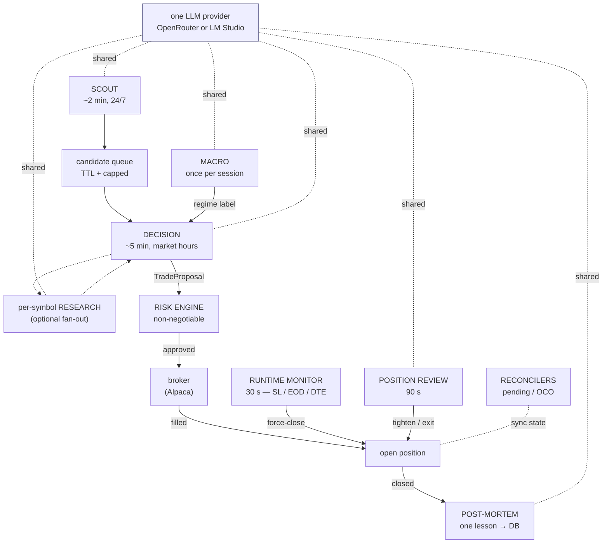
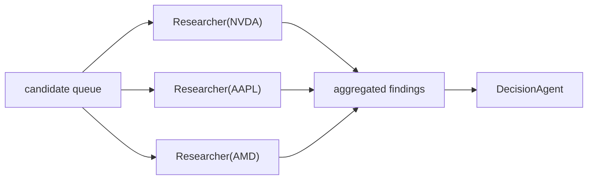

# The agent swarm

A swarm of specialized agents shares one LLM provider, one research tool
belt, and one risk engine. No agent ever places an order directly — every
proposal goes through the engine first. The dashboard streams every event
over SSE so you can watch the swarm work in real time.

For the data model, scheduler robustness, and per-broker locking, see
[ARCHITECTURE.md](ARCHITECTURE.md).

---

## End-to-end flow

---

## Roster

| Agent / loop              | Cadence            | Cost / tick         | Job                                                                                     |
|---------------------------|--------------------|---------------------|-----------------------------------------------------------------------------------------|
| **Scout**                 | 2 min, 24/7        | 0–1 small call      | Movers + screener fan-in; optional LLM refinement → candidate queue                     |
| **Macro**                 | once per session   | 1 call/day          | Risk-on / off / volatile / ranging label injected into the decision prompt              |
| **Decision**              | 5 min, market only | 1 call + tools      | Drains queue, runs research belt, emits structured `TradeProposal`                      |
| **Researcher (chat)**     | on demand          | per round           | `/research` page; full tool belt for ad-hoc questions                                   |
| **Per-symbol research**   | per decision tick  | N parallel calls    | Optional fan-out — one focused researcher per symbol before the decision agent sees them |
| **Risk engine**           | per proposal       | 0 (mechanical)      | Validates `TradeProposal` against guardrails — last gate before broker                   |
| **Runtime monitor**       | 30 s               | 0 (mechanical)      | Stop-loss, EOD, DTE auto-close                                                          |
| **Position review**       | 90 s, market only  | 1 call/tick         | LLM scan over open positions — hold / close / tighten_stop with parallel tool calls     |
| **Pending reconciler**    | 30 s               | 0                   | Polls PENDING orders; promotes to OPEN on fill, CANCELED on reject                      |
| **Bracket reconciler**    | 45 s               | 0                   | Closes local trade rows when one leg of an OCO fires at the broker                      |
| **Safety monitor**        | 30 s               | 0                   | Circuit-breaker (N consecutive losses) + DTE watchdog                                   |
| **Post-mortem**           | per close          | 1 small call        | Structured lesson written to DB for future prompts to consume                           |
| **Risk-config generator** | on demand          | 1 call              | LLM-suggested risk caps from `/risk-config` "auto-tune" button                          |

---

## Multi-agent fan-out

When `MULTI_AGENT_ENABLED=true`, the decision tick becomes a fan-out /
fan-in driven by `app/ai/orchestrator.py::Orchestrator`:

- `MULTI_AGENT_FOCUS_COUNT` (default 3) controls fan-out width.
- Each per-symbol researcher gets its own bounded tool budget
  (`MULTI_AGENT_PER_AGENT_TOOL_CALLS`, `MULTI_AGENT_PER_AGENT_ROUNDS`).
- Researchers run in parallel via `asyncio.gather`, so a 3-way fan-out
  costs ~one researcher's wall-clock — not 3×.
- Findings are rendered as a markdown block injected into the decision
  agent's user message (`format_findings_for_decision`).

Off by default: pre-research over a long candidate queue burns tokens,
and the single-agent path is good enough for most days. Turn it on for
high-conviction sessions.

---

## Key design choices

- **One scheduler, one process.** All loops run on a single
  `AsyncIOScheduler`. No Celery, no Redis, no extra workers — Ctrl-C
  shuts the whole swarm down cleanly.
- **One shared tool belt.** `app/ai/research_toolbelt.py` backs the
  researcher chat, the decision agent, and the per-symbol researchers.
  Add a tool there and every agent sees it.
- **Per-broker serialization.** Every loop touching a broker takes
  `get_lock(market.value)` first, so the monitor can never see a stale
  OPEN row while the pending reconciler is promoting it.
- **No agent opens positions on its own.** Scout, Researcher, Macro,
  Position-review, Post-mortem all *inform*; only the decision agent
  proposes, and only the risk engine approves.
- **Heartbeats per loop.** Successful ticks stamp
  `app/scheduler/heartbeat.py`; `/api/system/status` exposes the
  snapshot so an external watchdog can page on a stale loop.
- **Multi-agent mode is a flag.** `MULTI_AGENT_ENABLED=true` turns the
  decision tick into a fan-out / fan-in. Higher quality, higher cost.

---

## Where each agent lives

| Agent                  | File(s)                                                |
|------------------------|--------------------------------------------------------|
| Scout                  | `app/scheduler/scout.py`, `app/ai/scout_agent.py`      |
| Macro                  | `app/ai/macro_agent.py`                                |
| Decision               | `app/strategies/claude_stocks.py`, `app/scheduler/loop.py` |
| Research belt          | `app/ai/research_toolbelt.py`                          |
| Researcher (chat)      | `app/ai/researcher.py`                                 |
| Multi-agent orchestrator | `app/ai/orchestrator.py`                             |
| Risk engine            | `app/risk/engine.py`                                   |
| Runtime monitor        | `app/scheduler/monitor.py`                             |
| Position review        | `app/ai/position_review_agent.py`, `app/scheduler/position_review.py` |
| Reconcilers (pending / bracket) | `app/scheduler/runner.py`                     |
| Safety monitor         | `app/scheduler/runner.py`                              |
| Post-mortem            | `app/ai/post_mortem_agent.py`                          |
| Risk-config generator  | `app/ai/risk_config_generator.py`                      |
