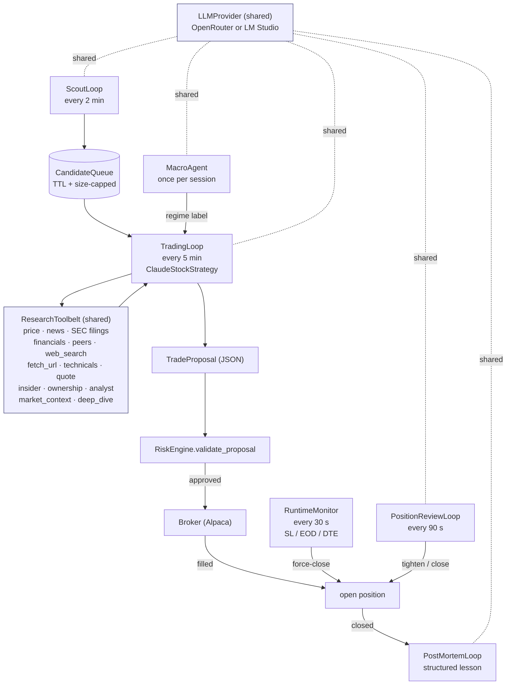
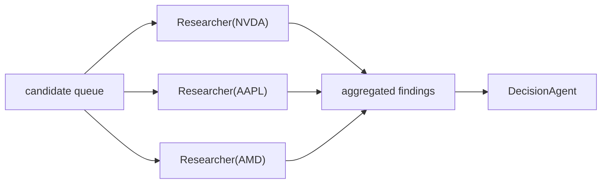

# Architecture

This doc is the "how it actually fits together" deep dive. The top-level
[README](../README.md) covers setup and usage; this one covers the agent
mesh, the scheduler, the risk engine, and the data model.

---

## Process layout

One FastAPI process hosts everything:

- **HTTP + SSE** — REST endpoints and the live activity stream
- **Scheduler** — `AsyncIOScheduler` owning every background loop
- **Activity bus** — in-process pub/sub; every event is also persisted
- **SQLite** — `autotrader.sqlite`; async via aiosqlite

There are no separate worker processes, no Redis, no Celery. Everything
is one process, which keeps the dev loop tight and makes Ctrl-C
sufficient to shut down cleanly.

When the app boots (see `app/main.py::lifespan`):

1. `init_db()` runs `Base.metadata.create_all` on the SQLite file.
2. Seed defaults inserted if missing (`RiskConfig` row, `LlmRateCard`, `SystemState`).
3. Activity bus hooks up its persistence sink.
4. `_build_scheduler(settings)` composes broker, strategy, engine, loops.
5. `SchedulerRunner.start()` registers every loop on one scheduler.
6. FastAPI starts serving.

On shutdown, `SchedulerRunner.stop()` drains cleanly.

---

## The agent mesh

Five scheduled loops + two cameo agents, all sharing one LLM provider
and one `ResearchToolbelt`. For the user-facing roster (cadence, cost,
job per agent), see [AGENTS.md](AGENTS.md).

### Multi-agent fan-out (optional)

When `MULTI_AGENT_ENABLED=true`, the decision tick becomes a fan-out /
fan-in driven by `app/ai/orchestrator.py::Orchestrator`:

- `MULTI_AGENT_FOCUS_COUNT` (default 3) controls fan-out width.
- Each per-symbol researcher gets its own bounded tool budget
  (`MULTI_AGENT_PER_AGENT_TOOL_CALLS`, `MULTI_AGENT_PER_AGENT_ROUNDS`).
- Researchers run in parallel via `asyncio.gather`, so a 3-way fan-out
  costs ~one researcher's wall-clock — not 3×.
- Findings are rendered as a markdown block injected into the decision
  agent's user message (`format_findings_for_decision`).

Off by default: pre-research over a long candidate queue burns
considerable tokens, and the single-agent path is good enough for most
days. Turn it on for high-conviction sessions or when you want a paper
trail showing the swarm split a thesis across symbols.

### Loop responsibilities

| Loop                  | Cadence       | Agent                 | What it does                                                |
|-----------------------|---------------|-----------------------|-------------------------------------------------------------|
| ScoutLoop             | 2 min (24/7)  | (optional) ScoutAgent | Scans movers + screener, pushes candidates onto the queue   |
| TradingLoop           | 5 min (hrs)   | ClaudeStockStrategy   | Drains queue, researches, asks LLM, proposes, executes      |
| RuntimeMonitor        | 30 s          | —                     | Checks stop-loss, EOD, DTE; force-closes on breach          |
| PositionReviewLoop    | 90 s (hrs)    | PositionReviewAgent   | LLM reviews open positions vs fresh news; tighten / exit    |
| PostMortemLoop        | on close      | PostMortemAgent       | Writes a structured lesson to the DB for each closed trade  |
| MacroAgent            | per session   | MacroAgent            | Regime label consumed by the decision prompt                |
| SafetyMonitor         | 30 s          | —                     | Circuit breaker (N consecutive losses) + DTE watchdog       |
| PendingReconciler     | 30 s          | —                     | Polls PENDING orders' broker status; promotes to OPEN on fill, CANCELED on reject/cancel |
| BracketReconciler     | 45 s          | —                     | Reconciles bracket (OCO) legs with the broker — closes the trade locally when one leg fires |

Every loop checks `SystemState.trading_enabled` and the `pause_agents`
flag before doing work, so the kill switch and the soft-pause both
instantly stop new activity without killing the scheduler.

### Per-broker serialization

Every loop acquires `get_lock(market.value)` before hitting the broker.
TradingLoop, RuntimeMonitor, PositionReviewLoop, BracketReconciler, and
PendingReconciler all share the same lock per market, so two loops
can't race on the same Alpaca account — e.g. the monitor won't see a
stale "OPEN" row while the pending reconciler is promoting it.

### Scheduler robustness

The `AsyncIOScheduler` is configured with `coalesce=True`,
`max_instances=1`, and `misfire_grace_time=60s`. A tick that runs long
(LLM call that outlasts its cadence) coalesces into one catch-up tick
instead of stranding the schedule, and overlapping firings for the same
job never stack.

Every tick is wrapped by `_safe_call(fn, label)` in
`app/scheduler/runner.py`:

- Exceptions are caught, logged, and published on the activity bus as
  `scheduler.error` events — one bad tick never kills the scheduler.
- On success, `heartbeat.mark(label)` stamps the loop's last-alive
  timestamp. `/system/status` (authenticated) exposes the snapshot so an
  external watchdog can page on a stale heartbeat (APScheduler silently
  stopped firing, event loop stalled, tick hung upstream of `_safe_call`).
  A failing tick deliberately does NOT stamp — "alive but erroring" is
  distinguishable from "healthy". `/health` stays as the unauthenticated
  liveness probe.

Heartbeats are in-memory (`app/scheduler/heartbeat.py`); they clear on
restart and repopulate as loops tick.

### Decide-timeout guard

`TradingLoop` wraps `strategy.decide(snapshot)` in
`asyncio.wait_for(..., timeout=decide_timeout_sec)` (default 180 s).
An LLM call that hangs a provider connection records a `decide_timeout`
rejected Decision and returns cleanly; the next tick proceeds as normal
instead of wedging the loop indefinitely.

### Research belt = the source of truth

`app/ai/research_toolbelt.py` is one class, one tool set, three
consumers:

- **Researcher chat** (`/research`) — full tool belt
- **Decision agent** (strategy) — data-heavy subset, no `deep_dive`
- **Per-symbol research agents** (multi-agent mode) — same as decision

Adding a tool in the belt makes it available to every consumer with no
extra wiring. The dispatcher handles malformed calls defensively:
- **Arg aliases** (`symbols`, `ticker`, `ticker_symbol`, `tickers`,
  `company_symbol` → `symbol`)
- **Nested wrappers** (`{"input": {"symbol": "AAPL"}}` → `{"symbol": "AAPL"}`)
- **Bare-string args** (coerced to `{"symbol": ...}` or `{"url": ...}`)
- **Ticker-shaped tool names** (`AAPL` → inferred from args)
- **Fuzzy name match** (camelCase / missing underscore typos)
- **Tool-inference from args** (`timeframe` → `get_intraday_history`,
  `form_type` → `get_sec_filings`, `query` → `web_search`, etc.)

See `dispatch()` + `_dispatch_inner()` in that file.

---

## Risk engine

`app/risk/engine.py::RiskEngine` is the one component that MUST be
bulletproof. Every trade the LLM proposes goes through it before a
broker call, even in paper mode. Live mode also requires the startup
secrets guard to pass (`settings.assert_secrets_configured()`).

Pre-trade checks (reject if any fails):

1. Global `trading_enabled` flag (kill switch)
2. Total deployed capital ≤ `budget_cap_usd`
3. New position size ≤ `max_position_pct` of budget
4. Open position count < `max_concurrent_positions`
5. Symbol not in `blacklist`
6. Daily trade count < `max_daily_trades`
7. Daily P&L > `-daily_loss_cap` → HALT for the day
8. Cumulative drawdown > `-max_drawdown` → HALT until human unpause
9. Stop-loss is present and within bounds

Runtime monitor (every 30 s):
- Checks live price vs stop-loss → auto-close on breach
- EOD auto-close for day-trading stocks
- DTE auto-close for option positions (`option_dte_watchdog_days`)
- Recomputes daily P&L → trips HALT if needed

When any HALT is tripped, a row is written to `halts` with reason and
timestamp; the UI surfaces it on the dashboard. An explicit
`POST /api/unpause` clears it.

---

## Data model

Every table is in `app/models/` as a SQLAlchemy row class. Key rows:

| Table             | What it stores                                                  |
|-------------------|-----------------------------------------------------------------|
| `system_state`    | Global trading-enabled flag + paper/live flag                   |
| `risk_configs`    | Versioned; one marked `is_active`                               |
| `decisions`       | Every LLM decision: prompt, proposal, verdict, rationale        |
| `trades`          | Filled orders with entry/exit/realized-P&L                      |
| `activity_events` | Persisted copy of every published activity event                |
| `halts`           | Each time a guardrail tripped + reason + resolution             |
| `llm_usage`       | Every LLM call with tokens, cost, agent tag, tool-call trail    |
| `llm_rate_cards`  | Per-model $/token; versioned, one active                        |
| `post_mortems`    | Per-closed-trade structured lesson                              |
| `research_conversations` / `research_messages` | Researcher chat |

The `decisions` + `trades` tables are joined by `decision_id` so the
`/decisions` page can surface the outcome of each decision.

---

## Frontend shape

Next.js 16 App Router, one `src/app/<route>/page.tsx` per route. All
pages are client components — there's no SSR data fetching because the
API needs an auth header the frontend shouldn't render into HTML.

State flows:

- **Polling** for anything slow-changing (trades list, decisions list).
- **SSE** for the live activity log.
- **Explicit refresh** buttons where the user is in control.
- **No TanStack Query** — the API surface is small enough that
  `fetch` + `useState` inside a `useEffect` is clearer.

---

## Secrets posture

- Every secret lives in `backend/.env`, git-ignored.
- `settings.assert_secrets_configured()` is called from `lifespan` when
  `PAPER_MODE=false`. It refuses to boot for live trading if any of
  `ALPACA_API_KEY / ALPACA_API_SECRET`, `JWT_SECRET`, the active
  provider's API key, or (when enabled) `POLYMARKET_PRIVATE_KEY` still
  contain `replace_me`. Paper mode skips the gate so dev loops aren't
  blocked on unset optionals.
- `.gitignore` blocks `.env`, `.env.*`, `*.pem`, `*.key`, `wallet.json`,
  `keystore/`, and the SQLite files.
- A gitleaks pre-commit hook catches accidental key-shaped strings (see
  top-level README for setup).
- The frontend `NEXT_PUBLIC_API_KEY` is intentionally *not* a secret —
  it's a shared password that scopes the backend to your machine.
  The backend should not be exposed publicly.

---

## Extending

Common changes and where they go:

| Change                                  | File(s)                                                     |
|-----------------------------------------|-------------------------------------------------------------|
| New risk guardrail                      | `app/risk/engine.py` + `tests/test_risk_engine.py`          |
| New research tool                       | `app/ai/research_toolbelt.py` (+ optional render card)      |
| New scheduled loop                      | `app/scheduler/<name>_loop.py` + wire in `app/main.py`; wrap tick with `_safe_call` (heartbeat + error isolation) via `runner.py` |
| New broker                              | `app/brokers/<name>.py` + `build_broker()` in `brokers/__init__.py` |
| New page                                | `frontend/src/app/<route>/page.tsx` + add link to NavBar    |
| New API endpoint                        | `backend/app/api/routes.py` (or a focused file) + client in `frontend/src/lib/api.ts` |
